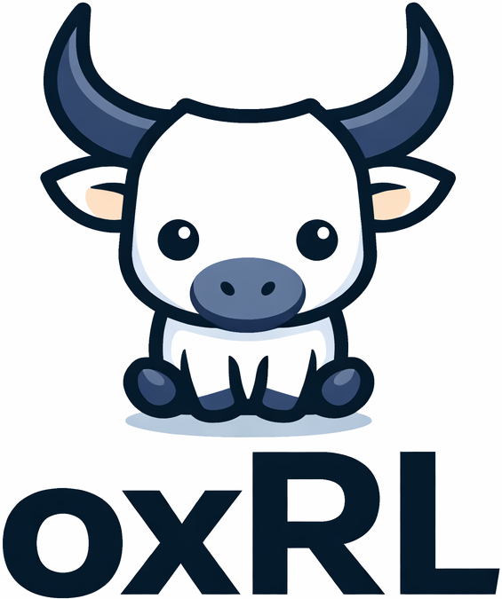

<p align="center">
  
</p>

<h1 align="center">oxRL</h1>

<p align="center"><strong>Post-train any model under 10 lines of code.</strong></p>

<p align="center">A lightweight post-training framework for LLMs, VLMs, and VLAs. Maximizing developer speed. Scales to billions of parameters with DeepSpeed, vLLM, and Ray.</p>

---
## 🚀 New in v1.1: Reasoning & Multimodal RL

We've significantly expanded oxRL's capabilities to support the latest trending architectures and training recipes:

*   **Verifiable Reasoning (Open-R1):** Native support for reasoning models with `<thought>` and `<answer>` tag enforcement and rule-based correctness rewards.
*   **Simple Preference Optimization (SimPO):** State-of-the-art reference-free alignment that reduces VRAM by 40% and improves logical reasoning.
*   **Multimodal RL:** Support for Vision-Language (VLM) and Audio-Language models. Seamless base64-to-tensor pipeline for on-policy rollouts.
*   **GPQA & ScienceQA:** Integrated high-difficulty reasoning and multimodal datasets.
*   **Memory-Efficient LoRA:** Built-in PEFT integration allows post-training 14B+ models on restricted hardware.

---
## Usage (Python API)

Post-train any model in under 10 lines of code. oxRL auto-detects your hardware and can auto-prepare common datasets.

```python
from oxrl import Trainer

# 1. Initialize with your model (LoRA enabled for 7B+)
trainer = Trainer(model="deepseek-ai/DeepSeek-R1-Distill-Llama-8B")

# 2. Start reasoning post-training (Verifiable RL)
trainer.train(task="openr1-math")
```

---

## Supported Models

The following models have been verified and onboarded using our automated pipeline. You can find ready-to-use scripts in the `examples/onboarded_models/` directory.

| Model | Size | Task | Strategy | Status |
|:---|:---|:---|:---|:---|
| **DeepSeek-R1-Distill-Llama-8B** | 8.0B | Reasoning | LoRA | ✅ Verified |
| **DeepSeek-R1-Distill-Qwen-7B** | 7.0B | Reasoning | LoRA | ✅ Verified |
| **Qwen2.5-Coder-7B-Instruct** | 7.6B | Coding | LoRA | ✅ Verified |
| **Qwen2-Audio-7B-Instruct** | 7.0B | Audio | LoRA | ✅ Verified |
| **Qwen2-VL-7B-Instruct** | 7.0B | Vision | LoRA | ✅ Verified |
| **Gemma-3-1b-it** | 1.0B | Multimodal | Full-tuning | ✅ Verified |
| **Mistral-7B-Instruct-v0.3** | 7.0B | Instruct | LoRA | ✅ Verified |
| **Qwen2.5-7B-Instruct** | 7.0B | Math | LoRA | ✅ Verified |
| **SmolLM2-1.7B-Instruct** | 1.7B | Instruct | Full-tuning | ✅ Verified |

---

## System Architecture

```
┌─────────────────────────────────────────────────────────────────┐
│                         oxRL Framework                          │
├─────────────────────┬───────────────────┬───────────────────────┤
│   Training Engines  │  Rollout Engines  │    Config + Data      │
│   (Ray + DeepSpeed) │  (Ray + vLLM)     │    (Pydantic + HF)    │
├─────────────────────┼───────────────────┼───────────────────────┤
│                     │                   │                       │
│  algs/grpo.py       │ rollouts/         │ configs/load.py       │
│    SGRPO loss       │   vllm_engine.py  │ configs/*.yaml        │
│    LoRA / PEFT      │   replay_buffer.py│                       │
│  algs/PPO/ppo.py    │                   │ datasets/             │
│  algs/SFT/sft.py    │                   │   prompt_only.py      │
│                     │                   │   (Multimodal Ready)  │
├─────────────────────┴───────────────────┴───────────────────────┤
│  swarm/             │  utils/logging.py  │  rewards/compute_score  │
│    orchestrator.py  │  utils/setup.py    │  (Reasoning / Code)     │
└──────────────────┴────────────────────┴─────────────────────────┘
```

## RL Training Workflow

1.  **Scout Agent:** Discovers model metadata and ensures `chat_template` compatibility.
2.  **Multimodal Pipeline:** Converts base64 images/audio into PIL/NumPy for vLLM rollouts.
3.  **LoRA Lifecycle:** Train with adapters, save with gathered ZeRO-3 weights, and **auto-strip PEFT prefixes** for immediate vLLM compatibility.
4.  **Verifiable Rewards:** Programmatic verification of CoT tags and mathematical correctness.

## Quick Start

### Installation

```bash
pip install oxrl
pip install peft  # For LoRA support
```

### Post-train a Reasoning Model

```yaml
# config.yaml
model:
  name: "deepseek-ai/DeepSeek-R1-Distill-Qwen-7B"
lora:
  enabled: true
reward:
  reward_func: "reasoning_reward_func"
data:
  dataset: "openr1_math"
```

```bash
python main_rl.py --config-file config.yaml
```

## Algorithms

| Algorithm | File | Description |
|-----------|------|-------------|
| **SGRPO** | `algs/grpo.py` | Stable GRPO — Clipped surrogate loss with LoRA support and reference-free variants. |
| **SimPO** | `algs/simpo.py` | Simple Preference Optimization — Reference-free and length-normalized alignment. |
| **CISPO** | `algs/grpo.py` | Clipped importance-sampling policy optimization. |
| **PPO** | `algs/PPO/ppo.py` | Proximal Policy Optimization with GAE and value clipping. |

## Project Structure

```
oxRL/
├── main_rl.py              RL training loop (Ray + DeepSpeed)
├── swarm/                  Autonomous model onboarding (Scout, Bugfixer)
├── preprocessing/          Reasoning (OpenR1), Multimodal (Vision/Audio) preprocessors
├── rollouts/               vLLM inference with structured prompt support
├── rewards/                Verifiable reasoning and coding rewards
```

## design-principles

**Debuggability over Pipelining.** oxRL avoids complex async pipelining to ensure that failure states are 100% reproducible and logs are clear.

**LoRA-first for 7B+**. We default to LoRA for larger models to enable high-quality research on consumer-grade and restricted high-end hardware.

**Verification-driven RL.** We prioritize datasets where the reward is verifiable (Math, Code, Format) to drive logical discovery.

## Contributing

Contributions are welcome. Please follow the existing architectural patterns and style.

## FAQ

Check out the [FAQ](FAQ.md) for details on LoRA merging and Multimodal input formatting.
