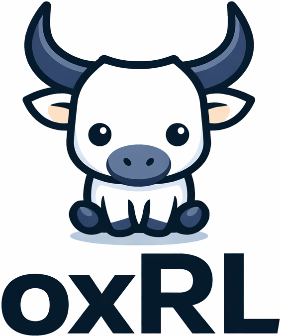

<p align="center">
  
</p>

<h1 align="center">An Claude-friendly framework for any post-training</h1>

<p align="center">A lightweight post-training framework for LLMs and VLMs. Maximizing developer speed. Scales to billions of parameters with DeepSpeed, vLLM, and Ray.</p>

<p align="center">
  <a href="https://pypi.org/project/oxrl/"></a>
  <a href="https://github.com/warlockee/oxRL/stargazers"></a>
  <a href="https://colab.research.google.com/github/warlockee/oxRL/blob/main/examples/oxrl_quickstart.ipynb"></a>
  <a href="https://github.com/warlockee/oxRL/blob/main/LICENSE"></a>
</p>

---

## Why oxRL?

| | oxRL | TRL | OpenRLHF |
|---|---|---|---|
| **Algorithms** | 51 | ~12 | ~5 |
| **Verified Models** | 38 | — | — |
| **Lines to train** | 3 | ~30 | ~50 |
| **RL Engine** | vLLM + Ray | Native | vLLM + Ray |
| **SL Engine** | DeepSpeed | Native | DeepSpeed |

---
## Design Principle

Context-length minimized principle. Following [LLM Oriented Design](https://github.com/warlockee/llm-oriented-design-patterns). So your LLM agent will not suffer from OOT or IQ loss problem. 

---
## Usage

Post-train any model in under 10 lines of code. oxRL auto-detects your hardware, auto-prepares datasets, and scales to multi-GPU automatically.

```python
from oxrl import Trainer

# 1. Initialize with any HuggingFace model
trainer = Trainer(model="deepseek-ai/DeepSeek-R1-Distill-Llama-8B")

# 2. Start reasoning post-training (Open-R1 recipe)
trainer.train(task="reasoning")
```

---

## Supported Models

oxRL works with **any HuggingFace model** that supports `AutoModelForCausalLM`, including multimodal models via `AutoModelForImageTextToText`. No special integration needed — just pass the model name.

### Verified Models

These models have been explicitly verified through our automated onboarding pipeline:

| Model | Size | Task | Strategy |
|:---|:---|:---|:---|
| **Qwen3-0.6B** | 0.6B | Instruct | Full-tuning |
| **Qwen2.5-0.5B-Instruct** | 0.5B | Math | Full-tuning |
| **Gemma-3-1b-it** | 1.0B | Instruct | Full-tuning |
| **Qwen2.5-1.5B-Instruct** | 1.5B | Math | Full-tuning |
| **Qwen2.5-Coder-1.5B-Instruct** | 1.5B | Coding | Full-tuning |
| **SmolLM2-1.7B-Instruct** | 1.7B | Instruct | Full-tuning |
| **Qwen2.5-3B-Instruct** | 3.0B | Math | Full-tuning |
| **DeepSeek-R1-Distill-Qwen-7B** | 7.6B | Reasoning | LoRA |
| **Qwen2.5-7B-Instruct** | 7.0B | Math | LoRA |
| **Qwen2.5-Coder-7B-Instruct** | 7.6B | Coding | LoRA |
| **Mistral-7B-Instruct-v0.3** | 7.0B | Instruct | LoRA |
| **Qwen2-Audio-7B-Instruct** | 7.0B | Audio | LoRA |
| **Qwen2-VL-7B-Instruct** | 7.0B | Vision | LoRA |
| **DeepSeek-R1-Distill-Llama-8B** | 8.0B | Reasoning | LoRA |
| **Qwen3.5-35B-A3B** | 35.0B (3B active) | Reasoning | LoRA |
| **Qwen2.5-Coder-0.5B-Instruct** | 0.5B | Coding | Full-tuning |
| **Llama-3.2-1B-Instruct** | 1.2B | Instruct | Full-tuning |
| **Qwen2.5-Math-1.5B-Instruct** | 1.5B | Math | Full-tuning |
| **Qwen2-VL-2B-Instruct** | 2.0B | Vision | Full-tuning |
| **Qwen3-VL-2B-Instruct** | 2.0B | Vision | Full-tuning |
| **SmolVLM-Instruct** | 2.3B | Vision | Full-tuning |
| **Gemma-2-2b-it** | 2.6B | Instruct | Full-tuning |
| **Qwen2.5-Coder-3B-Instruct** | 3.0B | Coding | Full-tuning |
| **Qwen2.5-VL-3B-Instruct** | 3.0B | Vision | Full-tuning |
| **Llama-3.2-3B-Instruct** | 3.2B | Instruct | Full-tuning |
| **Phi-3.5-mini-instruct** | 3.8B | Math | Full-tuning |
| **Qwen3-4B** | 4.0B | Math | Full-tuning |
| **Qwen3-VL-4B-Instruct** | 4.0B | Vision | Full-tuning |
| **Qwen2.5-Math-7B-Instruct** | 7.0B | Math | LoRA |
| **Qwen2.5-VL-7B-Instruct** | 7.0B | Vision | LoRA |
| **Qwen3-8B** | 8.0B | Math | LoRA |
| **Llama-3.1-8B-Instruct** | 8.0B | Reasoning | LoRA |
| **Gemma-3-4b-it** | 4.3B | Instruct | Full-tuning |
| **GLM-4-9B-Chat** | 9.4B | Instruct | LoRA |
| **Kimi-VL-A3B-Instruct** | 16.4B (2.8B active) | Vision | LoRA |
| **Kimi-VL-A3B-Thinking** | 16.4B (2.8B active) | Vision | LoRA |
| **Phi-4** | 14.7B | Math | LoRA |
| **Qwen3.5-27B** | 27.0B | Instruct | LoRA |

---

## System Architecture

```
┌──────────────────────────────────────────────────────────────────┐
│                          oxRL Framework                          │
├────────────────────────────────┬─────────────────────────────────┤
│     RL Path (main_rl.py)       │     SL Path (main_sl.py)        │
│  SGRPO / GSPO / CISPO / PPO   │  SFT / DPO / ORPO / KTO         │
│  RLHF / RLAIF                  │  CPT / KD / RM / RFT            │
│  Ray actors + vLLM rollouts    │  OnlineDPO / SPIN / IPO / SimPO │
│                                │  DeepSpeed distributed training │
├────────────────────────────────┴─────────────────────────────────┤
│  oxrl/algs/       Algorithms   │  oxrl/rollouts/   vLLM + Replay │
│  oxrl/configs/    Pydantic cfg │  oxrl/rewards/    Verifiable    │
│  oxrl/datasets/   HF loaders   │  oxrl/utils/      Setup + Logs  │
└──────────────────────────────────────────────────────────────────┘
```

## RL Training Workflow

1.  **Scout Agent:** Discovers model metadata and ensures `chat_template` compatibility.
2.  **Multimodal Pipeline:** Converts base64 images/audio into PIL/NumPy for vLLM rollouts.
3.  **LoRA Lifecycle:** Train with adapters, save with gathered ZeRO-3 weights, and **auto-strip PEFT prefixes** for immediate vLLM compatibility.
4.  **Verifiable Rewards:** Programmatic verification of CoT tags and mathematical correctness.

## Getting Started

### Installation

```bash
# From source (recommended for development)
git clone https://github.com/warlockee/oxRL.git
cd oxRL
pip install -e .

# Or from PyPI
pip install oxrl
```

### Run Tests

```bash
pip install pytest
pytest tests/test_bugs.py -v
```

### Environment Diagnostics

Before starting a long training run, verify your environment (GPUs, CUDA Toolkit, DeepSpeed, Ray) with our diagnostic tool:

```bash
oxrl doctor
```

### Configuration

oxRL uses YAML config files. See `oxrl/configs/rl_args.yaml` (RL) and `oxrl/configs/sl_args.yaml` (SL) for all available options with documentation. Example configs are in `registry/examples/`.

Key environment variables:
- `OXRL_DATA_DIR` — Override default data directory (default: `./data`)
- `OXRL_CHECKPOINT_DIR` — Override default checkpoint directory (default: `./checkpoints`)
- `HF_TOKEN` — HuggingFace token for gated models
- `GITHUB_TOKEN` — For autonomous bug reporting (optional)

### Post-train a Reasoning Model

```yaml
# config.yaml
model:
  name: "deepseek-ai/DeepSeek-R1-Distill-Qwen-7B"
lora:
  enabled: true
reward:
  reward_func: "reasoning_reward_func"
data:
  dataset: "openr1_math"
```

```bash
python main_rl.py --config-file config.yaml
```

## Algorithms

### Reinforcement Learning (via Ray + vLLM rollouts)

| Algorithm | File | When to use |
|-----------|------|-------------|
| **SGRPO** | `oxrl/algs/grpo.py` | Default for dense models. Token-level clipped surrogate, no critic needed. |
| **GSPO** | `oxrl/algs/grpo.py` | MoE models (Qwen3-MoE, DeepSeek-V3). Sequence-level ratios absorb routing noise between vLLM and HF/DeepSpeed. |
| **CISPO** | `oxrl/algs/grpo.py` | When SGRPO shows reward hacking or instability. Clipped ratio as detached weight on log-prob — more conservative. |
| **PPO** | `oxrl/algs/ppo.py` | When you need fine-grained credit assignment. Full PPO with value head + GAE. ~2x memory cost. |
| **RLHF** | `oxrl/algs/grpo.py` | Alias for SGRPO. Use for readability with reward-model setups. |
| **RLAIF** | `oxrl/algs/grpo.py` | Alias for SGRPO. Use for readability with AI-feedback setups. |

### Supervised Learning (via DeepSpeed)

| Algorithm | File | Description |
|-----------|------|-------------|
| **SFT** | `oxrl/algs/sft.py` | Supervised Fine-Tuning — Cross-entropy loss with masking and normalization. |
| **DPO** | `oxrl/algs/dpo.py` | Direct Preference Optimization — Pairwise preference learning with a reference model. |
| **ORPO** | `oxrl/algs/orpo.py` | Odds Ratio Preference Optimization — Reference-free preference alignment via log-odds. |
| **KTO** | `oxrl/algs/kto.py` | Kahneman-Tversky Optimization — Prospect-theory-inspired alignment with moving-average KL baseline. |
| **CPT** | `oxrl/algs/cpt.py` | Continued Pre-Training — Full-sequence language modeling on domain-specific text. |
| **KD** | `oxrl/algs/kd.py` | Knowledge Distillation — Teacher-student training with combined CE and KL divergence loss. |
| **RM** | `oxrl/algs/rm.py` | Reward Model Training — Bradley-Terry pairwise ranking with a learned scalar head. |
| **OnlineDPO** | `oxrl/algs/online_dpo.py` | Online DPO — DPO with on-the-fly rejection sampling in the data pipeline. |
| **RFT** | `oxrl/algs/rft.py` | Rejection Sampling Fine-Tuning — SFT on reward-filtered responses above a threshold. |
| **SPIN** | `oxrl/algs/spin.py` | Self-Play Improvement — DPO where rejected samples are the model's own prior outputs. |
| **IPO** | `oxrl/algs/ipo.py` | Identity Preference Optimization — Squared-loss variant of DPO for improved stability. |
| **SimPO** | `oxrl/algs/simpo.py` | Simple Preference Optimization — Reference-free, length-normalized preference alignment. |
| **CPO** | `oxrl/algs/cpo.py` | Contrastive Preference Optimization — Reference-free DPO + behavioral cloning regularizer (ICML 2024). |
| **AlphaPO** | `oxrl/algs/alphapo.py` | Generalizes SimPO with nonlinear reward shaping parameter alpha. |
| **R-DPO** | `oxrl/algs/rdpo.py` | Robust DPO — Length regularization to prevent length exploitation. |
| **cDPO** | `oxrl/algs/cdpo.py` | Conservative DPO — Label smoothing for noisy preference data. |
| **SPO** | `oxrl/algs/spo.py` | Self Preference Optimization — SiLU-based bounded loss (EMNLP 2025). |
| **DPNLL** | `oxrl/algs/dpnll.py` | DPO + NLL — Adds NLL on chosen to prevent chosen probability collapse. |
| **MinorDPO** | `oxrl/algs/minor_dpo.py` | Clamped reject penalty — stops penalizing once pi_l < pi_ref_l. |
| **C2DPO** | `oxrl/algs/c2dpo.py` | Constrained Controlled DPO — Quadratic penalty constraining deviation from reference. |
| **AlphaDPO** | `oxrl/algs/alpha_dpo.py` | Alpha-divergence DPO — Generalizes KL to alpha-divergence. |
| **AOT** | `oxrl/algs/aot.py` | Alignment via Optimal Transport — Wasserstein-based preference alignment. |
| **APO** | `oxrl/algs/apo.py` | Anchored Preference Optimization — Anchored to reference with adaptive margin. |
| **BCO** | `oxrl/algs/bco.py` | Binary Classifier Optimization — Trains binary classifier on preference pairs. |
| **BetaDPO** | `oxrl/algs/betadpo.py` | Dynamic Beta DPO — Adaptive beta scheduling (NeurIPS 2024). |
| **BPO** | `oxrl/algs/bpo.py` | Balanced Preference Optimization — Balances chosen/rejected gradients. |
| **CalDPO** | `oxrl/algs/caldpo.py` | Calibrated DPO — Calibration-aware preference learning (NeurIPS 2024). |
| **ChiPO** | `oxrl/algs/chipo.py` | Chi-squared Preference Optimization — Chi-squared divergence variant. |
| **CPOSimPO** | `oxrl/algs/cposimpo.py` | CPO + SimPO hybrid — Reference-free with length normalization. |
| **DiscoPOP** | `oxrl/algs/discopop.py` | Discovery of Optimal PO — Learns optimal loss function. |
| **DPOP** | `oxrl/algs/dpop.py` | DPO-Positive — Prevents chosen probability decrease. |
| **DPOShift** | `oxrl/algs/dposhift.py` | DPO with shifted baseline for improved stability. |
| **DRDPO** | `oxrl/algs/drdpo.py` | Distributionally Robust DPO — Minimax formulation over uncertainty set. |
| **EXO** | `oxrl/algs/exo.py` | Efficient Exact Optimization — Closed-form preference optimization. |
| **FDPO** | `oxrl/algs/fdpo.py` | Filtered DPO — Filters pairs by quality margin before training. |
| **FocalPO** | `oxrl/algs/focalpo.py` | Focal Preference Optimization — Focal loss weighting for hard examples. |
| **GPO** | `oxrl/algs/gpo.py` | Generalized Preference Optimization — Parameterized loss family. |
| **HDPO** | `oxrl/algs/hdpo.py` | Hybrid DPO — Combines multiple DPO objectives. |
| **Hinge** | `oxrl/algs/hinge.py` | Hinge loss preference optimization — SVM-style margin loss. |
| **NCA** | `oxrl/algs/nca.py` | Noise Contrastive Alignment — InfoNCE-based preference learning. |
| **ODPO** | `oxrl/algs/odpo.py` | Offset DPO — Adds learned offset to preference margin. |
| **RobustDPO** | `oxrl/algs/robust_dpo.py` | Robust DPO — Outlier-resistant with Huber-style loss. |
| **SamPO** | `oxrl/algs/sampo.py` | Sample-weighted Preference Optimization — Importance-weighted pairs. |
| **SPPO** | `oxrl/algs/sppo.py` | Self-Play Preference Optimization — Iterative self-play alignment. |
| **WPO** | `oxrl/algs/wpo.py` | Weighted Preference Optimization — Quality-weighted preference pairs. |

## Reward Functions

All reward functions share the signature `(prompt_ids, response_ids, finish_reason, metadata) → (rewards, is_per_token)`. Set via `reward_func` in your config YAML.

| Function | Signal | When to use |
|----------|--------|-------------|
| **default_reward_func** | Binary (EOS check) | Sanity checks or when reward comes from an external source. |
| **gsm8k_reward_func** | Binary | GSM8K and grade-school math with numeric answers. |
| **math_reward_func** | Binary | MATH dataset / competition math with `\boxed{}` answers. |
| **soft_math_reward_func** | Graduated (1.0/0.5/0.2) | Math tasks where binary reward is too sparse. Switch to binary once accuracy > ~20%. |
| **code_reward_func** | Binary | MBPP / HumanEval code-gen. Runs code against test cases. Requires `test_cases` in metadata. |
| **format_reward_func** | 0–1.0 (0.25 steps) | Instruction-following / style alignment without ground-truth answers. |
| **mcqa_reward_func** | Binary | MMLU-Pro / multiple-choice QA benchmarks. |
| **reasoning_reward_func** | 0–1.0 (tags + correctness) | DeepSeek-R1 style chain-of-thought training. Rewards `<think>` + `<answer>` tags. |
| **multimodal_reward_func** | 0–1.0 | Vision/audio tasks. Correctness + 0.2 fallback for modality awareness. |
| **rm_reward_func** | Continuous | RLHF with a trained reward model. Requires `reward_model_path` in config. |

## Project Structure

```
oxRL/
├── oxrl/                   # Core Framework Package
│   ├── trainer.py          # High-level Trainer API
│   ├── rewards/            # Verifiable reasoning and coding rewards (math, code, etc.)
│   ├── algs/               # 51 algorithm implementations (see tables above)
│   ├── swarm/              # Autonomous model onboarding (Scout, Bugfixer)
│   ├── preprocessing/      # Reasoning (OpenR1), Multimodal (Vision/Audio) preprocessors
│   ├── rollouts/           # vLLM inference with structured prompt support
│   └── datasets/           # Dataset loaders and samplers
├── main_rl.py              # RL training loop (Ray + DeepSpeed)
├── main_sl.py              # SL training loop (DeepSpeed) — 12 algorithms
├── registry/examples/      # Example configs for all 18 algorithms
├── examples/               # Ready-to-use recipes and training scripts
└── pyproject.toml          # Packaging and Installation
```

## Design Principles

**Debuggability over Pipelining.** oxRL avoids complex async pipelining to ensure that failure states are 100% reproducible and logs are clear.

**Robust Environment Handling.** oxRL is designed to work even in constrained environments. It automatically handles common CUDA/DeepSpeed mismatches by providing actionable warnings instead of fatal crashes.

**Autonomous Bug Reporting.** On framework failure, oxRL provides structured diagnostic signals for AI agents to automatically generate and submit GitHub issues (requires `GITHUB_TOKEN` environment variable).

**LoRA-first for 7B+**. We default to LoRA for larger models to enable high-quality research on consumer-grade and restricted high-end hardware.

**Verification-driven RL.** We prioritize datasets where the reward is verifiable (Math, Code, Format) to drive logical discovery.

## LLM Developer Map

This repository is optimized for LLM-assisted development (Claude/Gemini). If you are asking an AI to work on this framework, refer them to these "High-Signal" files:

- **Bug Reporting:** See `BUG_REPORTING.md` for instructions on autonomous issue submission.
- **Adding a New Algorithm:** See `oxrl/algs/base.py` (Base Class) and `oxrl/algs/grpo.py` (Implementation).
- **Adding a Reward Function:** Add to `oxrl/rewards/` using the signature in `oxrl/rewards/base.py`.
- **Changing Model Loading:** See `oxrl/utils/setup.py` -> `load_model_and_ref`.
- **Training Logic:** RL loop in `main_rl.py`, SL loop in `main_sl.py`.
- **Config Validation:** Logic is in `oxrl/configs/load.py`.

## Contributing

Contributions are welcome. Please follow the existing architectural patterns and style.

## FAQ

Check out the [FAQ](FAQ.md) for details on LoRA merging and Multimodal input formatting.

---

## Appendix: Why oxRL Uses Rollouts (Not an "Inference Server")

There is a growing claim in the community that the concept of a "rollout" is outdated and that inference servers are the new paradigm. We disagree. Here is our analysis of the debate and why oxRL is designed the way it is.

### The Claim

> "Rollout is outdated. Inference server is the new trend."

### Why This Is a Category Error

An inference server is not a *replacement* for rollouts — it is an *implementation strategy* for rollouts. Every RL training loop for LLMs still performs rollouts: the policy model autoregressively generates trajectories that are scored and used for gradient updates. The question is only **where and how** that generation happens.

| | Co-located (e.g. veRL HybridEngine) | Disaggregated (e.g. OpenRLHF, StreamRL) |
|---|---|---|
| Rollout runs on | Same GPUs as training | Separate inference server |
| Weight sync | In-memory NCCL | Network transfer |
| Scaling | Coupled | Independent |

Both approaches still generate rollouts. The "inference server" camp is running rollouts on a dedicated vLLM/SGLang process instead of in-process. That is an infrastructure decision, not a conceptual paradigm shift.

### Evidence Against "Rollouts Are Dead"

1. **NVIDIA is scaling rollouts *up*, not phasing them out.** [BroRL](https://developer.nvidia.com/blog/breaking-through-rl-training-limits-with-scaling-rollouts-in-brorl/) pushes rollout counts from N=16 to N=512 per prompt and demonstrates this breaks through performance ceilings where step-scaling cannot. If rollouts were obsolete, the latest NVIDIA research would not make them the primary scaling axis.

2. **Disaggregation has real costs.** Serialization overhead, network bandwidth for weight sync, and added orchestration complexity. Co-located approaches like veRL's HybridEngine avoid weight transfer overhead entirely by keeping generation and training on the same devices.

3. **The motivation for disaggregation is agentic RL, not rollout obsolescence.** Co-located rollouts break down when you need multi-turn tool use, because synchronous batch processing cannot handle variable-latency tool calls. That is a real constraint for agentic workloads — but it is a specific use case, not a universal indictment of rollouts.

4. **"Inference server" is rebranding.** Putting an HTTP endpoint in front of your rollout worker does not change the fundamental computation. [StreamRL](https://arxiv.org/abs/2504.15930) achieves a 2.66x throughput improvement through stream generation and skewness-aware scheduling — engineering wins *on the rollout pipeline*, not alternatives to it.

### Where oxRL Stands

oxRL uses **co-located vLLM rollouts** by design. For standard RL post-training (GRPO, PPO, RLHF) on math, reasoning, and coding tasks — which is the vast majority of practical post-training — this architecture is simpler, avoids network overhead, and produces fully reproducible training runs. We prioritize **debuggability over pipelining**.

If and when agentic multi-turn RL with tool use becomes the dominant training paradigm, disaggregated inference will be the right call. Until then, saying "rollout is outdated" is like saying "compilation is outdated because we use build servers now." The build server *does* the compilation. The inference server *does* the rollout. The abstraction changed; the computation did not.
